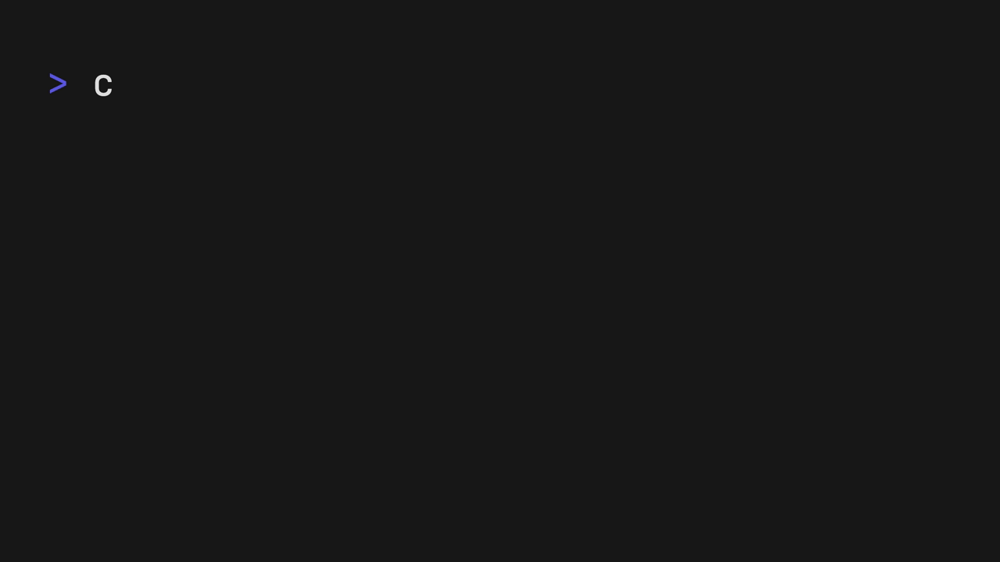

<p align="center">
  <a aria-label="Open Rodney Lab site" href="https://rodneylab.com" rel="nofollow noopener noreferrer">
    
  </a>
</p>
<h1 align="center">
  Macroquad Rapier Bevy ECS
</h1>

# macroquad-rapier-bevy-ecs

Demo for using the Bevy ECS in a Macroquad game with Rapier physics. This code accompanies the <a href="https://rodneylab.com/macroquad-rapier-ecs/">blog post on using a Macroquad Rapier ECS</a>. If you have any questions, please drop a comment at the bottom of that page.

## Usage



Clone the repo then run:

```shell
cargo run
```

## ☎️ Issues

Feel free to jump into the
[Rodney Lab matrix chat room](https://matrix.to/#/%23rodney:matrix.org).
